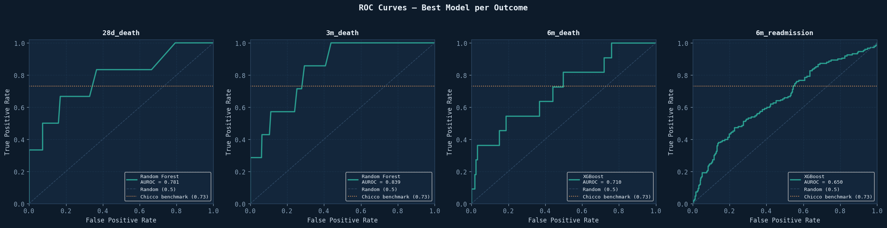
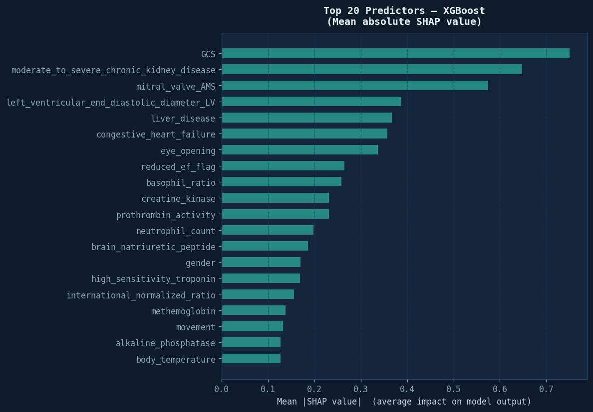
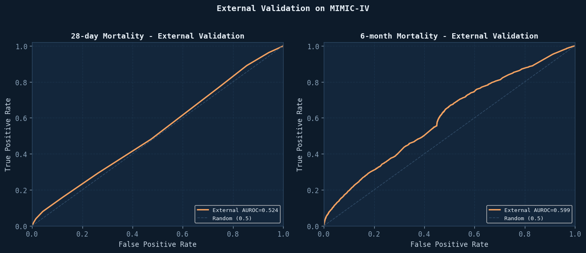

# HF-RISK: Leakage-Clean Heart Failure Outcome Prediction

HF-RISK is an MSc Data Analytics project that builds, audits, explains, and externally validates machine-learning models for adverse outcomes after hospitalisation with heart failure.

The project deliberately reports **leakage-clean** results. Earlier models looked stronger, but audit checks found administrative, temporal, and post-outcome proxy variables. Those variables were removed before the final modelling pass.

> **Research prototype only:** this repository is for academic/research demonstration. It is not clinically validated and must not be used for patient-care decisions.

## Project Highlights

| Area | Final Result |
|---|---:|
| Clean predictor set | 143 features |
| 28-day mortality internal AUROC | 0.781 |
| 3-month mortality internal AUROC | 0.839 |
| 6-month mortality internal AUROC | 0.710 |
| 6-month readmission internal AUROC | 0.650 |
| 6-month mortality MIMIC-IV external AUROC | 0.599 |
| 6-month mortality Brier score | 0.0268 |
| 6-month mortality ECE | 0.0227 |

## Why The Final AUROC Is Lower Than Earlier Results

The project originally produced stronger-looking AUROC values. A later audit found that some variables could act as shortcuts rather than genuine discharge-time predictors.

| Outcome | Before strict audit | Final leakage-clean test | Change | Final model |
|---|---:|---:|---:|---|
| 28-day mortality | 0.893 | 0.781 | -0.112 | Random Forest |
| 3-month mortality | 0.919 | 0.839 | -0.080 | Random Forest |
| 6-month mortality | 0.819 | 0.710 | -0.109 | XGBoost |
| 6-month readmission | 0.648 | 0.650 | +0.002 | XGBoost |

Variables removed from the final predictor set include:

- `Unnamed: 0`
- `inpatient.number`
- `dischargeDay`
- `outcome.during.hospitalization`
- readmission/emergency-return timing proxies

This reduction is a strength of the project: it reports a more conservative result that is easier to defend methodologically.

## Repository Structure

```text
.
├── scripts/                 # Numbered analysis pipeline scripts
├── hf_risk_render/          # Render-ready live Flask tool and model artifacts
├── docs/                    # Designed static project page for GitHub Pages
├── docs/assets/             # Website/chart assets
├── results/figures/         # Selected generated figures
├── results/tables/          # Aggregate CSV/JSON result summaries only
├── data/                    # Data instructions; raw datasets are not committed
├── models/                  # Model artifact instructions; .pkl files are not committed
├── requirements.txt         # Python dependencies
└── README.md
```

## Pipeline Scripts

| Script | Purpose |
|---|---|
| `01_eda.py` | Exploratory data analysis, missingness, class balance, clinical summaries |
| `02_preprocessing.py` | Leakage removal, feature engineering, imputation, train/test split |
| `03_modelling.py` | Logistic Regression, Decision Tree, Random Forest, XGBoost, LightGBM |
| `04_survival.py` | Kaplan-Meier, Cox PH, Random Survival Forest |
| `05_shap.py` | SHAP explainability for the primary model |
| `06_streamlit_tool.py` | Local research prototype for risk prediction |
| `07_external_validation.py` | Earlier external-validation helper |
| `08_external_validation_mimic.py` | Zhang-trained model tested directly on MIMIC-IV |
| `09_mimic_only_xgboost.py` | Separate MIMIC-only benchmark model |
| `10_advanced_evaluation.py` | Calibration, Decision Curve Analysis, gender/CKD subgroup checks |
| `run_hf_risk_colab.ipynb` | Colab runner for heavier compute |

## Live Tool Deployment

The repo also contains a dedicated Render deployment app in `hf_risk_render/`.

- **Purpose:** host the live HF-RISK research prototype
- **Stack:** Flask + Gunicorn
- **Inputs:** curated discharge-time fields
- **Outputs:** 4 real model probabilities + patient-level SHAP for 6-month mortality

If you deploy on Render:

- choose **Web Service**
- connect this repository
- set **Root Directory** to `hf_risk_render`
- use:

```bash
pip install -r requirements.txt
```

as the build command, and:

```bash
gunicorn app:app
```

as the start command.

## Data Design

The project uses two datasets:

1. **Zhang / PhysioNet heart failure cohort**
   - 2,008 hospitalised heart failure patients.
   - Main development dataset.
   - Models are trained and internally tested here.

2. **MIMIC-IV heart failure cohort**
   - 42,990 formatted heart failure patients in this project version.
   - Used for external validation and a separate MIMIC-only comparison.

The key distinction:

- **External validation:** train on Zhang, test directly on MIMIC-IV without retraining.
- **MIMIC-only comparison:** train and test a separate model within MIMIC-IV to show how much signal exists natively in that dataset.

Raw datasets are not included in this repository. See `data/README.md`.

## Reproducing The Pipeline

Install dependencies:

```bash
python -m venv .venv
.venv\Scripts\activate  # Windows
pip install -r requirements.txt
```

Place the required datasets in `data/`:

```text
data/dat.csv
data/mimic_hf_cohort.csv
```

Run the core pipeline from the repository root:

```bash
python scripts/01_eda.py
python scripts/02_preprocessing.py
python scripts/03_modelling.py
python scripts/04_survival.py
python scripts/05_shap.py
python scripts/08_external_validation_mimic.py
python scripts/09_mimic_only_xgboost.py
python scripts/10_advanced_evaluation.py
```

The scripts write outputs to `outputs/` and trained models to `models/` when run locally.

## Streamlit Research Prototype

The Streamlit app is included as a local/demo tool:

```bash
streamlit run scripts/06_streamlit_tool.py
```

It is not a deployed medical tool. It expects trained model artifacts and preprocessing outputs generated by the pipeline. The app is for demonstration/testing only.

## Designed Project Page

A designed static project page is included under `docs/`. If GitHub Pages is enabled for this repository using the `docs/` folder, the page can be published as a public project summary.

Open locally:

```text
docs/index.html
```

## Selected Figures







## Final Interpretation

HF-RISK shows that heart failure outcome prediction is possible, but also that apparently strong models can be inflated by leakage-prone variables. After removing those variables, internal performance became more conservative and external validation on MIMIC-IV showed dataset shift. That is the main methodological point of the project: honest model evaluation matters more than flattering headline AUROC.

## Author

Nikunj Prajapati  
MSc Data Analytics, London Metropolitan University  
Student ID: 24052351

## License

Code and documentation are provided for academic demonstration. Add an explicit open-source license before reuse in another project.
